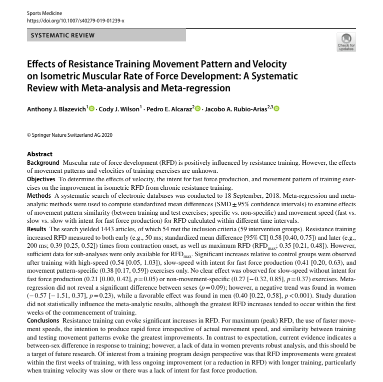

# Custom Local RAG[WIP]

## Description
This repo contains the necessary configuration to deploy a minimal local RAG locally, I'm using it for learning purposes so no production grade code to be found here.

My use case was to parse bank statements coming from 2 different companies(BBVA, Galicia) and store relevant information to be used with RAG in order for me to quickly get my expenses, unfortunately parsing bank statements PDFs which are 100% text and contain "tables" but not really as its just text lines separated by spaces was ugly. However I will include some code on getting text from PDFs which are easier to parse for general purpose RAG testing.

Why running a local RAG system?
Well I didn't want any AI company having my financial info, also posed a cool learning challenge

## Prerequisites
I'm using [Llama.cpp](https://github.com/ggml-org/llama.cpp) for LLM inferencing and embedding to be as lightweight as I could get. In order to run it we first need our favorite LLM model either already quantized or to be quantized by you in the GGUF file format.
Reference on how to do this [here](https://github.com/ggml-org/llama.cpp?tab=readme-ov-file#obtaining-and-quantizing-models)

An alternative is to use [ollama](https://ollama.com/) to download model files, just download the CLI and run the following command:

```bash
ollama pull model:tag
```

This will pull the model into `~/.ollama/models` for Linux or `C:\Users\User\.ollama` for Windows, check the manifest file to get which of the blob files corresponds to the model, also check that the file format is correct.

In my particular case I'm using this model `deepseek-R1-14b-Q4_K_m`, the GGUF file can be downloaded [here](https://ollama.com/library/deepseek-r1:14b). I'm using a distilled version of the model but works alright in my gaming PC, I'll detail my specs below.

## My PC specs
```
Operating system: Microsoft Windows 11 Pro, Version 10.0.26100
CPU: 12th Gen Intel(R) Core(TM) i7-12700K
RAM: 32.0 GB
Storage: SSD - 931.5 GB

Graphics card
GPU processor: NVIDIA GeForce RTX 3080 Ti
Direct3D feature level: 12_1
CUDA cores: 10240
Graphics clock: 1665 MHz
Resizable bar: No
Memory data rate: 19.00 Gbps
Memory interface: 384-bit
Memory bandwidth: 912.096 GB/s
Total available graphics memory: 28542 MB
Dedicated video memory: 12288 MB GDDR6X
System video memory: 0 MB
Shared system memory: 16254 MB
Video BIOS version: 94.02.71.40.df
IRQ: Not used
Bus: PCI Express x16 Gen4
```

I'm also using WSL and CUDA to offload layers to my GPU, if your setup is similar then you'll need the NVIDIA container toolkit and the CUDA toolkit installed on WSL. Check the [documentation](https://docs.nvidia.com/cuda/wsl-user-guide/index.html) on set this up.

## How to use
Every component in the system is configured in the [docker compose](./docker-compose.yml) file, you can take a look at each one there. Below is a brief description of each. 
Take into consideration that your use case might be different from mine so this might not fit your particular needs, also the logic is minimal to get things running.

### Chatter
This service uses the Llamma.cpp server component for LLM inferencing with any model you would like to use and an OpenAI compatible API endpoint, just change the mount path to your local directory and run. For more info in configuring the server take a look [here](https://github.com/ggml-org/llama.cpp?tab=readme-ov-file#llama-server) 

### Loader
The purpose of this script is to populate the vector DB by reading, parsing, embedding and uploading data into Qdrant. This part will need the most work for any custom RAG, right now it fits my use case.

### Qdrant
Service hosting [Qdrant](https://qdrant.tech/) vector DB

### Embedder
Simple embedding server endpoint using Llama.cpp, the model I'm currently using is very lightweight as it was created for this task. `nomic-embed-text-latest`

### Summary analyzer
Simple fast api endpoint to interface with the embedder and chatter services

### Example usage
- Change the docker-compose file for the loader volume mount and command with the path where your PDF is stored
```
command:
  - python
  - loader.py
  - --path /pdfs/resistance_training_movement_pattern.pdf
```
- Start services
```
docker compose up
```
- Check if files were loaded appropiately, you can query Qdrant directly using the following command
```
curl  -X POST \
  'http://localhost:6333/collections/pdf_chunks/points/scroll' \
  --header 'Content-Type: application/json' \
  --data-raw '{}'
```
- Wait until models are ready to serve, you should see the following log from the chatter service when ready
```
chatter-1  | main: model loaded
chatter-1  | <｜User｜>Hello<｜Assistant｜>Hi there<｜end▁of▁sentence｜><｜User｜>How are you?<｜Assistant ｜>'
chatter-1  | main: server is listening on http://0.0.0.0:8081 - starting the main loop
```
- Once finished, interact with the model asking relevant questions for the PDF you uploaded, for example: Using this study as reference 


And sending the following request: 
`curl http://localhost:8082/talk/   -d '{"content": "what is the effect of strength training in RFD?"}'   -H "Content-Type: application/json"`

I got as reponse 
```
{
  "choices": [
    {
      "finish_reason": "stop",
      "index": 0,
      "message": {
        "role": "assistant",
        "content": "<think>\nOkay, so I need to figure out the effect of strength training on RFD based on the provided context. First, I should understand what RFD stands for. From the context, I see that RFD refers to the Rate of Force Development, which is how quickly someone can produce force during muscle contractions.\n\nThe context mentions several studies and points of view. Let me go through it step by step.\n\n1. The context starts by talking about figures 4, 5, and 6 from a study by A. J. Blazevich et al. These figures seem to discuss the effects of strength training on RFD under different conditions, such as early vs. late changes, movement patterns, and training speeds.\n\n2. It then states that while high-speed movements likely improve RFD, the effects of heavy strength training (which is slow-speed) on RFD are less clear. There have been reports of increases, decreases, and no change in RFD after heavy strength training. So, the effect isn't straightforward.\n\n3. The text continues by explaining that RFD improvements are greatest in the early weeks of training but might plateau or even decrease with longer training, especially if the training is slow or lacks the intent to produce force quickly.\n\n4. It also mentions that the movement pattern during training influences RFD. If the movement pattern in training is similar to the test, RFD improvements are more likely. However, the context notes that the specificity of RFD enhancements hasn't been explicitly examined despite the specificity of maximum muscle strength changes.\n\n5. Furthermore, the context talks about other factors like contraction mode (concentric vs. eccentric) and whether the intent to develop force rapidly during training affects RFD. It seems that having the intent to produce force quickly during training, regardless of actual speed, is important for improving RFD.\n\nPutting this together, strength training can affect RFD in different ways depending on factors like the speed of movement, the intent during training, and the similarity between training and testing movement patterns. There's evidence of increases, but it's not consistent, and longer training might not always lead to continued improvements, especially under slow or non-intentful conditions.\n\nI think the main points are:\n- Heavy strength training may improve RFD but the effects are not uniform; some studies show increases, others show decreases, and some show no change.\n- The initial weeks of training show the most improvement, but this might taper off or even reverse with more time, especially with slow or less intent-driven training.\n- Movement specificity between training and testing matters; similar patterns likely lead to better RFD improvements.\n- The intent to produce force rapidly during training is crucial for enhancing RFD.\n\nSo, the effect of strength training on RFD isn't straightforward. It can lead to improvements, but it depends on several factors, and the effect might diminish over time if not optimized with speed and intent.\n</think>\n\nThe effect of strength training on Rate of Force Development (RFD) is multifaceted and influenced by several factors:\n\n1. **Variable Outcomes**: Heavy strength training may improve RFD, but the effects are not consistent. Studies report increases, decreases, and no change, indicating that the impact is not uniform.\n\n2. **Initial Improvements**: RFD improvements are most pronounced in the early weeks of training. However, these improvements may plateau or even decrease with longer training, particularly when training is slow or lacks the intent to produce force quickly.\n\n3. **Movement Specificity**: The similarity between training and testing movement patterns is crucial. RFD improvements are more likely when the movement patterns match, suggesting a specificity effect.\n\n4. **Intent and Speed**: The intent to produce force rapidly during training is significant. Even with slower movements, having this intent can enhance RFD, highlighting the importance of mental focus.\n\nIn conclusion, strength training can enhance RFD, but the extent and duration of these improvements depend on factors such as training speed, intent, and movement pattern similarity."
      }
    }
  ],
  "created": 1741113376,
  "model": "DeepSeek-R1-Distill-Qwen",
  "system_fingerprint": "b4779-d7cfe1ff",
  "object": "chat.completion",
  "usage": {
    "completion_tokens": 811,
    "prompt_tokens": 1052,
    "total_tokens": 1863
  },
  "id": "chatcmpl-FAamRCczQJu8SOG6xq5HX4vqqumtokwN",
  "timings": {
    "prompt_n": 1016,
    "prompt_ms": 528.654,
    "prompt_per_token_ms": 0.5203287401574803,
    "prompt_per_second": 1921.861936162405,
    "predicted_n": 811,
    "predicted_ms": 13625.591,
    "predicted_per_token_ms": 16.800975339087547,
    "predicted_per_second": 59.52035401620377
  }
}
```

## TODOs
- Parse LLM response
- Add nuke cli command to delete all points in a collection
